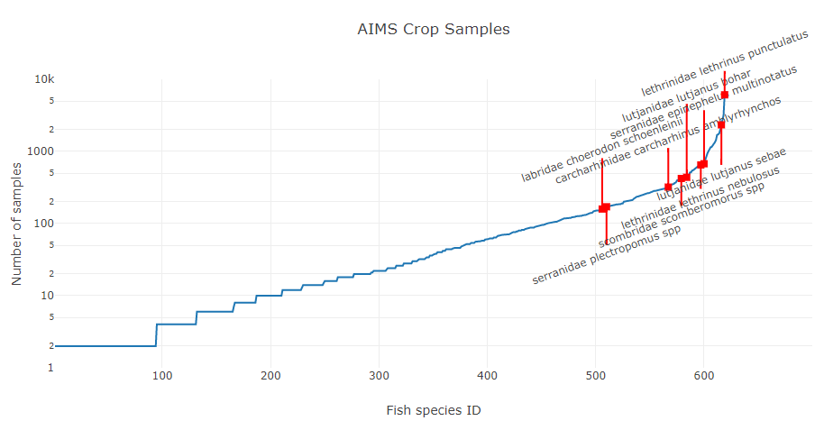

## Image Data Set
Currently there are 80823 labelled crops in the AIMS dataset. Below is a diagram of the number of samples collected per species of fish, with the currently selected 10 target fish marked in red.

While the ten selected sample fish are fairly well represented in the dataset, there are other species with larger numbers of sample images that may be worth considering:

| Family        | Genus       | Species             | Count |
| ------------- | ----------- | ------------------- | -----:|
| lethrinidae   | lethrinus	  | punctulatus         | 6095
| caesionidae   | pterocaesio | digramma            | 3172
| lethrinidae   | lethrinus   | atkinsoni           | 2635
| lutjanidae    | lutjanus    | sebae               | 2338
| labridae      | thalassoma  | lutescens           | 2007
| lethrinidae   | lethrinus   | rubrioperculatus    | 1782
| labridae      | thalassoma  | lunare              | 1725
| pomacentridae | pomacentrus | coelestis           | 1693
| lutjanidae    | lutjanus    | vitta               | 1435
| balistidae    | melichthys  | niger               | 1338